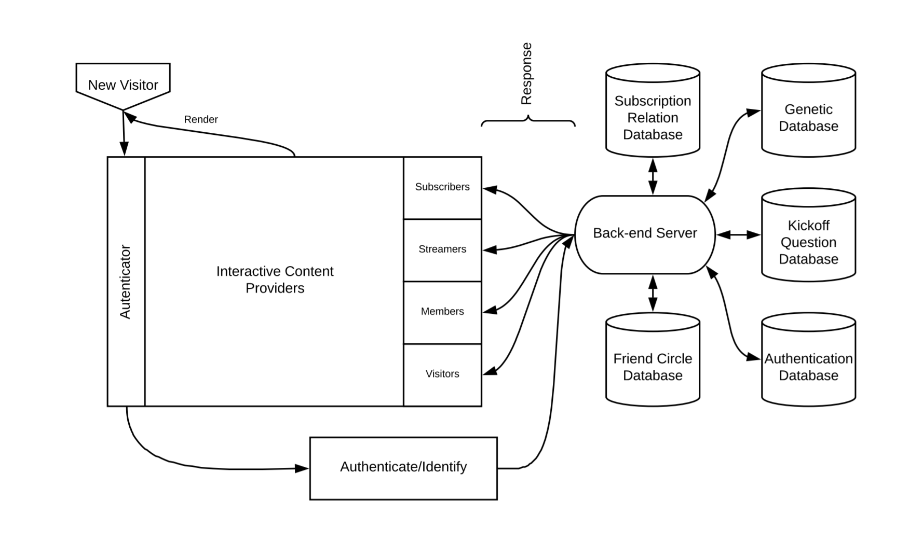

# CS1320 Final  
### Problem 1

I would like to design a live-stream ecosystem with social media functionality. The live-stream platform will setup and redirect users based on their personal interests with a kickoff questionnaire. The subscribers can  subscribe to the streamers that they like and since people are grouped by their personal interests, they are very likely to stick to the same channel and make friends with each other. A community will be formed by the end of this stage. In addition, the platform will incorporate the social media functionality in its membership system. Compared to the traditional judging compatibility system, members of the platform can use their genetic data to test the 'compatibility' between two genomes.

Expert in DNA testing and biometrics can play a role in the membership system. Expert in natural language processing can help to fine-tune the channel pairing service, and expert in psychology can help to design the kickoff questionnaire to collect useful psychological information for the new users.

This platform will resolve several requirements for different type of users.
- Streamers: Make money from subscribers when streaming.
- Regular Users: View potential highly compatible live-stream at no cost.
- Subscribers: Enjoy real-time notification when favorite streamers come online.
- Members: Access the social media platform with nearby genetic compatible recommendations.

****
### Problem 2

> Alice often work till late-night and she is used to listen to radios before  sleeping. Now, instead of listening to possibly repeated and random radio, she is able to access non-repeated fresh live streams that always fit to her interest.

> Bob get bored of Tinder-style dating app which focus primarily on photos and find it difficult to find matches based on hobbies, taste etc. Once he joined the platform as a memeber, he found he is able to find nearby matches for both personal tastes and genetic similarity. He will meet with the ones in the same community and does not need to worry about what to talk about at the first meet.

> Charlie is an outdoor enthusiast. He hopes people can step out of their house and enjoy the beauty of nature. With the new live-stream platform, he can share and publish his latest outdoor event and post events for the like-minded people.
****
### Problem 3
The front-end browser will send command and request to the back-end server. The back-end server will authenticate the request and provide different contents based on the identities. For example, if the request is sent from a visitor, the live stream and live comments will be rendered with APIs to upgrade to either member or subscriber.

If the request is sent from a memeber, the server will fetch data from the database and push a list of nearby people based on their genetic similarity. The server will also need to contact the local cache and load (if any) chat history of that member's friend circle. At the same time, a web socket connection should be opened if the member want to chat with someone.

If the request is sent from a subscriber, the front-end will expose an interface for the user to manage his/her browsing history and list of subscribes. This interface should be linked the back-end server such that whenever the user makes a change to the list, the server will automatically update the database entry related to that user. Moreover, a messaging server like Kafka should be used to handle data integration and (real-time data processing) notifications.

_List of technologies needed:_
**Database:** The platform will use a database to store what users have answered in the kickoff questionnaire and genetic data for members' genetic compability test requests.
**Access Control:** It will use access control with token-based autentication, authorization and identification to render different views for visitors, streamers, subscribers and members.
**Content Delivery Network + Real Time Messaging Protocol:** The application is able to provide real time streaming.
**NLP model:** The system will also require a natural language processing model to extract keywords from an existing channel to better refine its recommendation system.
**Messaging Server:** The application will push notifications to subscribers based on what they have subscribed.
****
### Problem 4
**Security Concerns for the clients:**
- *SQL injection:* We use database to store users' kickoff questions, it mean the system will be suffered from SQL injection hazards if not query inputs are not handled correctly.
- *Broken Authentication:* Application timeouts aren't set properly. User uses a public computer to access site. Instead of selecting “logout” the user simply closes the browser tab and walks away. Attacker uses the same browser an hour later, and that browser is still authenticated. /Attacker acts as a man-in-middle and acquires user's session id from network traffic. Then uses this authenticated session id to connect to application without needing to enter user name and password./Insider or external attacker gains access to the system's password database. User passwords are not properly hashed, exposing every users' password to the attacker.
- *Cross-Site Scripting (XSS):*  Application takes untrusted data and sends it to a web browser without proper validation or escaping. XSS allows attackers to execute scripts in the victims' browser, which can access any cookies, session tokens, or other sensitive information retained by the browser, or redirect user to malicious sites.
- *Insecure Direct Object References:* A direct object reference occurs when a developer exposes a reference to an internal implementation object, such as a file, directory, or database key. Without an access control check or other protection, attackers can manipulate these references to access unauthorized data.
- *Sensitive Data Exposure:* Sensitive information like credit card info and genetic data are not hashed. If the application does not use SSL/TLS for all authenticated pages, an attacker can monitor network traffics and steals users' session cookie and hack into the users' database with sensitive data.
- *Missing Function Level Access Control:* Application need to perform the same access control checks on the server when each function is accessed. Otherwise, the attackers may forge request and access authenticated pages without authentication.
- *Others:* Includes CSRF, Insecure components, redirects, ReDos attack and so on.

**Suggestions as to what the application might do to mitigate these.**
- Avoid writing own regular expression
- Avoid using forward and redirects/Avoid using parameters in calculating destinations.
- Generate CSRF tokens to mitigate the CSRF attack.
- Using functional level check instead of "presentation level access control" to provide acess control.
- Use HTTPS/WSS secure connections and encrypt all sensitive data in transits.
- Use per-user indirect reference to do query on the server instead of exposing the paramter choice to users.
- Input validation and sanitization and output encoding on server side for correct context.
- Do the processing on server side instead of on client side as client side code is under high risk to be tempered.

****
### Problem 5
*Here is a list of the privacy concerns that clients should be aware of*
- We collect information to help analyze users' preferrence
- We collect users' geolocation under permission
- We will keep users' activity information for <DURATION> to promote users' experience in our application
- We will not share users' data unless user explicitly allows it.
- We will not leak users' personal information but may allow Cookie-based ad tracking in our application.

*Here is what the privacy policy for the website should contain.*
- Where the privacy policy applies
- Information that we collect
- Information that we receive from others about the clients
- Information that the clients give us
- How will we use information
- How will we share information
- Users' rights
- How will we protect the users' information
- How long will we keep the information once collected
- Users' rights to delete/update the information
****
## Developers Only:

#### Problem 10

  
Above is an illustration of the basic system design of the application. Once a user visits the index url, the page will redirect the user to a authentication page for the old users to enter passwords and account info and new users to register. The authentication page will then send the information entered to the backend server via RESTful APIs, the backend server will contact the database to verify if any fields should be updated and send a response with the content that the front-end should server with.

| Name                     | Method | Requests Params                                                                             | Response                                                                                     | Description                                                                                                                                                        |
|--------------------------|--------|---------------------------------------------------------------------------------------------|----------------------------------------------------------------------------------------------|--------------------------------------------------------------------------------------------------------------------------------------------------------------------|
| /login                   | GET    | Empty                                                                                       | The desired login template file                                                              | Return a transpiled login page                                                                                                                                     |
| /authenticate            | POST   | Login credentials                                                                           | Authentication status: {Failed/ Pass}, User type: {Visitor, Subscribers, Streamers, Members} | If success will redirect user to the /redirect page when loading If failed, when prompt user to reenter their login credentials                                    |
| /redirect                | GET    | None                                                                                        | Necessary parameters to help the page render the client view                                 | Query will be done at server side and lists of different routing path will be rendered, a callback will desired next page will be called once contents are loaded. |
| /channel/:channelName{*} | GET    | None                                                                                        | Mount the streaming connection                                                               | Open streaming portal based on the channel name                                                                                                                    |
| /view/subscribes         | POST   | User session token                                                                          | A list of streamers the user subscribed                                                      | Use the user session token to find desired information                                                                                                             |
| /view/circle             | POST   | User session token; Enable Geolocation: {true, false}; Enable Genetic Search: {true, false} | Friend circle of the user and chat history if user talked with someone before                | Use the user session token to find desired information                                                                                                             |

> If the user is a streamer, the streamer should at least see an option to open his/her live channel, once the channel goes live, the frontend will contact the backend such that it can contact the database, get the subscribers of that channel and push notifications to subscribers of that channel.

> If the user is a subscriber, the front end should send a request to the back end and the backend will decide what to render based on the kickoff question database. The user will then see a list of recommended channels in the view.

> If the user is a member, the front end will notify the backend to fetch users' genetic data. Meanwhile, the backend will load the friend circle and chat history for that user. The user will be promptly whether he/she want to share the geolocation and let the system do genetic matches in the channel for he/she.

Note that different views will be provided based on users' types.

****
#### Problem 11
This is a server-side application and thus alomost all request will be handled by using front-end, back-end and database together.
> *Authentication:* Users will enter their login information in a React login view, the credentials will be sent to the server via HTTP post request. The server will query if the user exists and the type of that user if so. The react view will receive response from the server including the type of that user and some parameter useful for rendering.

> *Streaming:* Once a streamer want to go live, the RESTful API will send a request to server and server will query the subscribers for that streamer and push notifications using some messaging framework (e.g. Kafka). The server will open a port for the streamer and setup CDN+RTMP for that port.

> *Recommendation System:* Everytime a realtime comment is posted to a certain channel, the NLP model running in the server will collect it and use it for online training. The model will be updated says once per day. After verifying user's credential, the NLP model will use the personal kickoff setting along the real time trending to decide what channel will be posted to that user.

> *Membership service:* Registered member can customize their preference at any time to disable/enable genetic matching and geolocation sharing. Once enabled, the corresponding module will send a request to the server and the server will query if there is any online memeber nearby. A websocket connection should be initialized using lazy loading if the user want to talk with someone and chat history will be fetched from the cache if possible.
****
#### Problem 12
I will use Node.js as the back-end server, React.js as my front-end, and MongoDB as my database.
The reason that I choose Node.js is that it has a powerful built in npm ecosystem such that we dont have to reinvent the wheel. For example, we can simply use `express`/`React-Router-DOM` to setup our router logics and `bcrypt` for hashing and salting the passwords.
Dealing with asychronous requests and responses used to be painful in ES5. However, things have changed since ES6 as ES6 now officially supports Promise to handle these asychronous tasks. This makes the application easy to be developed using NodeJS.

As for React, it is a nature choice for any large scale front-end project as it divides the project into components and let them easy to be reused and maintained. Its internal virtual DOM support also makes hotreloading faster. In addition, compared to Vue.js, React's ecosystem is more mature and has more available packages to use. It is also much easier to debug and to understand the workflow comparing to AngularJS.

#### Problem 13
I choose MongoDB rather than traditional relational database since it is more flexible and is schema-less and more natural to JSON type data. We have to redesign and update the database if we change the kickoff questionnaire and it is very unlikely for the server to store genetic data for everyone in a fixed schema. Therefore, MongoDB may outperform and RDBS under this usecase.

Although MongoDB documents tends to have larger size compared to the relational ones (since it has hidden index and file names), MongoDB is scalable and is faster when doing scale-read (using replica sets) and scale-write (sharding), which supports extendability of the database.

****

#### Problem 14
What types of testing would you recommend. How does your design facilitate such testing?
- *Usability test:* We can do extensive and thorough usability test to our application. For example, we can setup a 'soft opening' periods to hear from users advices and continuously improve the product until it is officially shipped and deployed.
- *Front end test:* If we start off our project from the `create-react-app` boilerplate, it is shipped with `Jest` and Facebook has a well documented tutorial for how to do the test with `Jest` since that is the testing  framework that they use along with react.
- *Back end test:* NodeJs is shipped with `Mocha` and `Chai` for module testing and we can simply use `assert` for inline testing.
- *Compatibility testing:* We can do compatibility testing at browsershots.org to make sure users enjoy the same smooth experience using browsers with different versions.
- *Performance testing:* JMeter includes load test and stress test to guarantee the product behaves well with large volume of users.
- *Security testing:* We can use Netspark to test users' sensitive data are not exposed to the public and the access control system does work.

****
http://nodegoat.herokuapp.com/tutorial
https://gearheart.io/blog/7-best-frameworks-for-web-development-in-2017/
https://facebook.github.io/jest/docs/en/tutorial-react.html
https://medium.com/of-all-things-tech-progress/starting-with-authentication-a-tutorial-with-node-js-and-mongodb-25d524ca0359
https://stackoverflow.com/questions/5244437/pros-and-cons-of-mongodb
